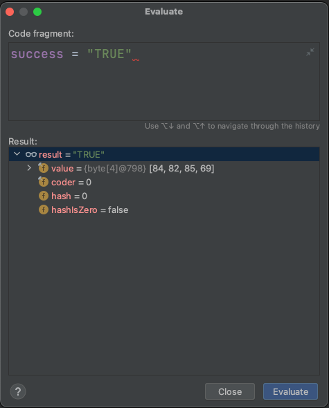

# Evaluate Expression

## THEORY

The "Evaluate Expression" feature in a debugger allows you to manually evaluate and execute expressions during runtime, providing a way to inspect variables, perform calculations, and execute code snippets within the context of your program's execution.

It is often used to see if a specific `if` statement would evaluate to true.

With this setting you can also alter properties:
`test.setSuccess("TRUE")`

Execute side processes:
`service.performSomeLogic();`

Fetch additional information from database etc: 
`JdbcTemplate.query("SELECT...", emptyMap<>(), (rs, rowNum) -> return rs.getString("COL")`

> **_WARNING:_**  The code will really execute. If your `if` branch is relying on the boolean value of a delete statement it is important to realize that by evaluating the delete result in the expression, the record will be deleted and the if statement will do the opposite of what it would.

## OVER TO YOU!

Remember that `RuntimeException`?  

Now run the code again with a breakpoint at line 18.

By clicking on the line or the calculator icon, you will be able to evaluate expressions before continuing the code.

The popup that is shown will show why the if branch is not being used. 
So you can fix this behaviour by setting success to TRUE for now. 

Now click the 'resume program'/play icon next to the stack. 

Congrats! Your string is correctly shown. 
