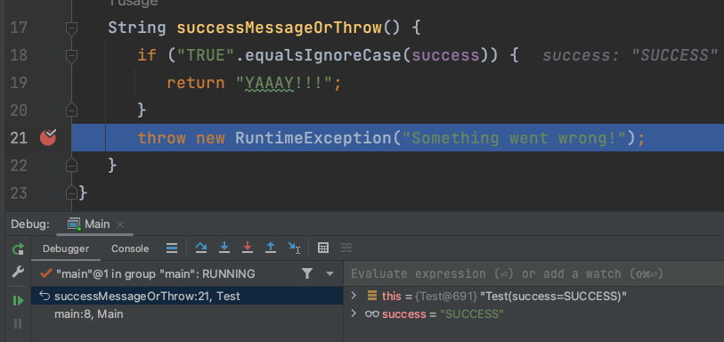
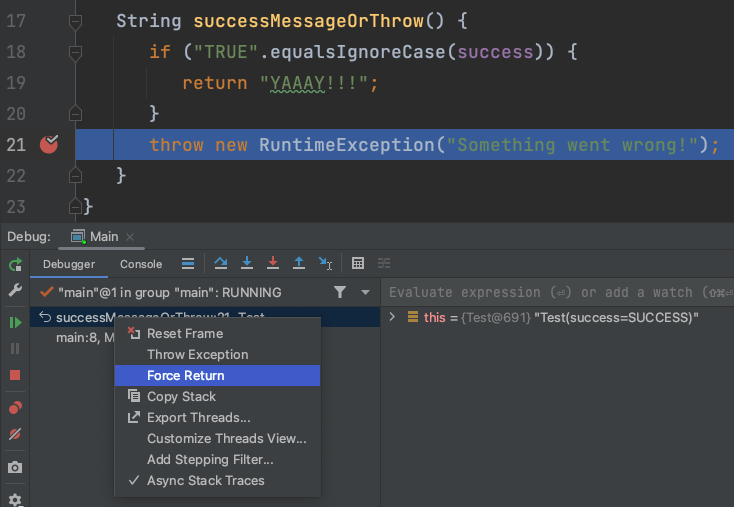
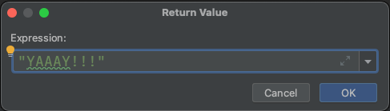

# Force return

## THEORY

The "Force Return" feature in a debugger allows you to modify the return value of a method during runtime, specifically for debugging purposes. 
It can be useful when you want to observe or test a particular branch of code that is executed based on the return value of a method.

The "Force Return" feature can be handy in situations where it's difficult to reproduce certain conditions or when you want to simulate specific scenarios for debugging purposes. It allows you to explore different execution paths without modifying the actual code.

However, it's important to remember that the "Force Return" feature is intended for debugging purposes and should be used with caution. Modifying the return value of a method during runtime can alter the program's behavior and may not reflect the actual behavior when running outside of the debugger. It's crucial to ensure that the changes made with "Force Return" are only applied within the debugging session and not saved or committed as part of the codebase.

## OVER TO YOU!

Remember that `RuntimeException`?  

Now run the code again with a breakpoint at line 21.

By right mouse clicking on the stack (left bottom), you will be able to choose some options to intervene in the code execution.
We will choose Force return.

The popup that is shown will allow you to put any java expression there. 
So you can either return a fixed string as the popup shows, or use the test object's success property to decide the value by typing `this.success` 

Now click the 'resume program'/play icon next to the stack, to finalize the program. 

Congrats! Your result is printed to the console. 
