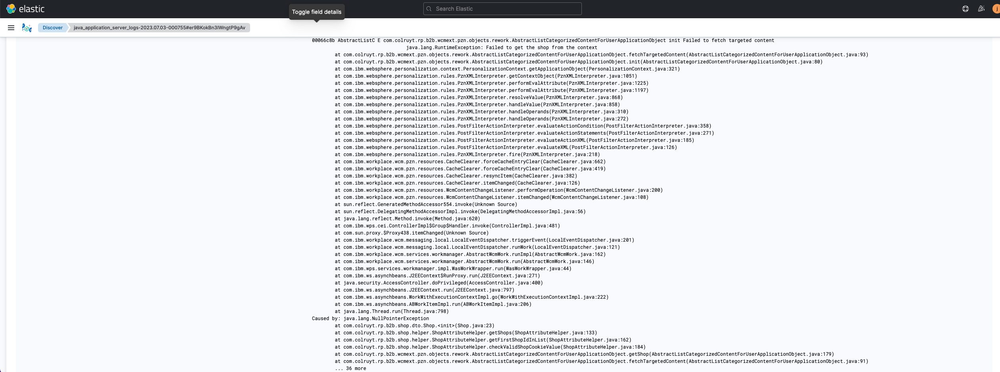

# Stepping

## THEORY

### Navigating through code
**Step Over:** The Step Over feature allows you to execute the next line of code in your program without stepping into any method calls. This is useful when you want to quickly move to the next line of code without diving into the details of the method being called.

**Step Into:** The Step Into feature allows you to enter and execute the next line of code, including method calls. If the line of code contains a method call, IntelliJ IDEA will step into that method, allowing you to examine its behavior and variables. This is useful when you want to understand how a particular method is executed and inspect its internal workings.

**Step Out:** The Step Out feature allows you to quickly move out of the current method being debugged and return to its caller. This is helpful when you're stepping through a method but realize that you're no longer interested in its internal details. By stepping out, you can skip the remaining lines of code within the method and return to the calling code.

**Run to Cursor:** The Run to Cursor feature allows you to execute your program until it reaches the line of code where your cursor is currently placed. It bypasses the need for setting temporary breakpoints and lets you quickly run your program up to a specific point. This can be useful for skipping repetitive or less important sections of code.
content predicted: step over, step into, step out, run to cursor, stack, drop stack...

### Stack(trace)

**Stack:** In the context of debugging, the stack refers to the call stack or the sequence of method invocations that led to the current point of execution. It represents the order in which methods were called and provides a visual representation of the program's execution flow.
When debugging in IntelliJ IDEA, the Debugger panel typically includes a view called "Frames" or "Call Stack" that displays the current state of the call stack. Each entry in the call stack represents a method invocation, with the topmost entry being the currently executing method.
You can click through this stack and go back in execution to see what certain variables where at that specific point in place. 

**Stacktrace:** a stack trace refers to a textual representation of the call stack at a specific point in the program's execution. We typically see stacktraces printed out for exceptions, but you can actually always consider your running code as "stacks" which you could see the trace of.

**Drop frame:** By dropping a frame, one can really send his/her code back in time, by removing some of the last entries from the stack. That way you can move your execution point back in time, alter some variables (see previous section "intervene") and make your code forcibly end up in other branches of the code.  

## OVER TO YOU!

### Stepping

- Set a breakpoint on the line where `result = add(5, 7);` is called. Use the step over feature to execute the next line and observe the changes in the variables in the debugger view.
- Use the step into feature to enter the `subtract()` method and observe its behavior. Pay attention to the variables and the execution flow. Using the step over feature you can go over the c assignment and the through the result end up in the main method again.
- Set your cursor on the `checkResult()` method's if method. Use the run to cursor feature to execute the program up to that line and observe how it reaches that point skipping the division method.
- See how the method will throw an exception? Let's click the continue play button to continue run and see the stacktrace.

### Analyze the stacktrace

If all is well your stacktrace will show something like this.

```shell
Exception in thread "main" java.lang.RuntimeException: Something went wrong!
	at Main.calculateAndCheck(Main.java:32)
	at Main.main(Main.java:5)
```

With this setup is is very hard to identify the root cause of the exception. Something went wrong, but what?
For this reason it is important that, while developing try catch mechanisms, you (almost) always wrap the causing exception. Luckily almost all exceptions have this constructor built-in.

Now add the caught exception as a parameter: `throw new RuntimeException("Something went wrong!", e);`

Run the code again. You will see the stacktrace changes:

```shell
Exception in thread "main" java.lang.RuntimeException: Something went wrong!
	at Main.calculateAndCheck(Main.java:29)
	at Main.main(Main.java:5)
Caused by: java.lang.IllegalArgumentException: There is an invalid result.
	at Main.checkResult(Main.java:58)
	at Main.calculateAndCheck(Main.java:27)
	... 1 more
Caused by: java.lang.RuntimeException: Root cause: result is 6
	at Main.checkResult(Main.java:55)
	... 2 more
```

You clearly see the following details (line by line explained):

- the main method thread failed with a Runtime Exception. 
- This runtime exception happened in our Main.calculateAndCheck method.
- It was the Main.main method that called the Main.calculateAndCheck method.


- The RuntimeException that happened was **caused by** another IllegalArgumentException.
- This exception was thrown in Main.checkResult method
- It was the Main.calculateAndCheck method that called the Main.checkResult method.


- The IllegalArgumentException that happened was **caused by** another RuntimeException.
- This exception happened at Main.checkResult method.

You can even see the correct line numbers where exceptions are being thrown.
As you can see the last caused by is most often the root cause impacting a higher calling method. It is therefore important to always check the **entire** stacktrace.

In this example the stackt trace is rather easy to analyze. In real world examples it is important to use the same approach to debug your exception.
The methods which are invoked might however be surrounded by proxies (Spring boot aurowiring).
But the theory also applies here. Inside these proxies you will always find your own application code also.
It is therefore important to look at package names inside the stacktrace. 

In IntelliJ printed stacktraces, your own code will be displayed as a link and is clickable.
In Kibana, the same information is there but there are no clickable links.

Can you find the reason, line, class... of the following stacktrace?



<div class="hint">
  There is a NPE thrown in the constructor of the Shop class at line 23. 
</div>

### Reset frames
- Now put a breakpoint on the `checkResult()` method's if method. You will see that the method would throw an exception. 
- Run the code in debug mode. The code will halt on the if statement.
- Use the reset frame feature to jump back to the invocation of the main method. (2 up in the stack). You can do this in the debugger stack view by right mouse clicking on an earlier point or clicking on the backward arrow next to the row on hover. 
- Observe how the program's state is rewound, and the execution resets to the frame that called the calculateAndCheck method.
- Click run again, code will again go back to if statement.
- Now use the reset frame to go up 1 frame
- Adapt the result internal variable to something else. 
- Will the if statement still fail?  
