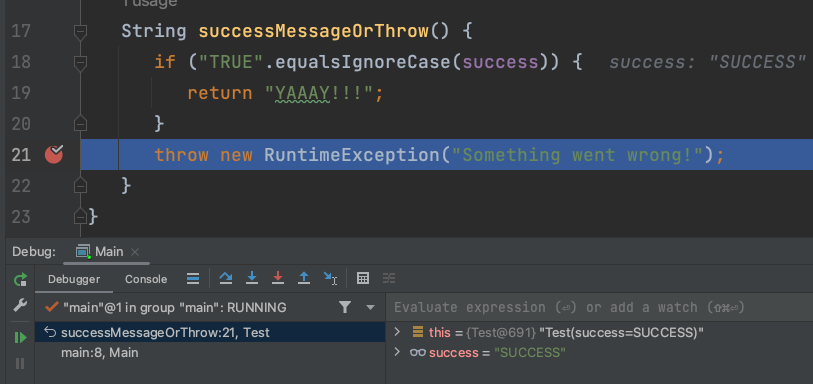

# Throw Exception

## THEORY

The "Throw Exception" feature in a debugger allows you to manually throw an exception during runtime for debugging purposes. It enables you to simulate exceptional scenarios or test error-handling code paths in your program without waiting for those specific conditions to naturally occur.

As with the "Force Return" feature, it's important to remember that the "Throw Exception" feature should be used judiciously and only during debugging sessions. Any exceptions thrown using this feature will not occur in the normal execution of your program outside of the debugger.

## OVER TO YOU!

Remember that `RuntimeException`?  

Now run the code again with a breakpoint at line 21.

By right mouse clicking on the stack (left bottom), you will be able to choose some options to intervene in the code execution.
We will choose Throw Exception.

The popup that is shown will allow you to put any java expression there. 
So you can either return a fixed exception as the popup shows, or call some custom code to determine which exception to throw. 

Now click the 'resume program'/play icon next to the stack, to have the program crash. 

Congrats! Your new stacktrace is visible. 
