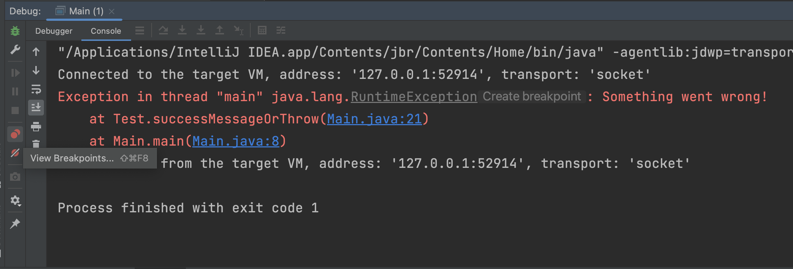

# Muting breakpoints

## THEORY

A breakpoint can be muted if a certain condition is met. This will slightly impact performance but allow for easier holding execution only on the points of interest. 

The codebase of this example remains the same. The only thing that changed is the amount of times this chain is called.
Unfortunately, 99% of requests go fine. There is however one of them which is not. Seems like a real world example, does it not?

Based on the previous courses, you should be able to identify the culprit class/method. 
But is going over this breakpoint for each entry the correct thing to find the culprit "record"? 

Let's find out!

## OVER TO YOU!

- Looking at the code, there is a main with some requests being filtered.
- Run it in debug mode
- Code will fail
- Stacktrace indicates line 81 to be the thrown exception.
- Put a breakpoint on the first line of this method
- Run it again
- Is the first record the culprit? What about the second? And the third?
- Do not go clicking through every line in the list.
- Copy the if statement's content: `!request.getResource().matches("^\\/v([0-9])\\/[a-zA-Z]+\\/[a-z0-9A-Z]+$")`
- Right mouse click on the breakpoint.
- Add the copied text as a condition
- Rerun in debug mode.
- Can you fix the error?

  Having a hard time finding the failure?

  The idea is giving you some suggestions on the calling line of code.

  Still can't find it?

  Search google for `Cyrillic encoding`. And remember this as an often used "tool" by hackers for phishing.

> Could I not find this just as easy by putting my breakpoint at line 81? Yes, you could have. Just showing all the options. Spring for example often uses exceptions for normal behaviour flow impact. In such a case, muting some might be nice.

## THEORY

All breakpoints can be muted if you only want to enable them after a few prerequisites are met.

Simply by using the mute all breakpoints button.

## THEORY

Single breakpoints can also be easily muted using the windows provided by IntelliJ.

Imagine that the entire code would be filled with breakpoints (as we see too often happen).
You can easily manage them through the view breakpoints button. 

When you click this button, a popup will open.

In the example picture you can see that I have put a breakpoint on every method manually PLUS a method breakpoint. 
One can also catch every exception by enabling the Java Exception Breakpoint. (More on this later)

Take a good look at the options here in the window: 

|                       |                                                                                                                                                                                                                                                  |
|-----------------------|--------------------------------------------------------------------------------------------------------------------------------------------------------------------------------------------------------------------------------------------------|
| Enabled               | Whether or not you want to enable this breakpoint's behaviour.                                                                                                                                                                                   |
| Suspend               | Does code needs to halt execution or not? (See earlier lessons)                                                                                                                                                                                  |
| Condition             | If a condition is given, the breakpoint will only execute when condition is met.                                                                                                                                                                 |
| Log                   | You can log the breakpoint hit message or the stacktrace of current execution.                                                                                                                                                                   |
| Evaluate and log      | You can log the result of the code in the evaluate setting.                                                                                                                                                                                      |
| Remove once hit       | If you only need a breakpoint once, it might be useful to delete it immediately after hit.                                                                                                                                                       |
| Disable until hitting | If a method is called multiple times but you do not want to break all the time, you could put a breakpoint in a method that must be run before this one. Best to make that one a non-suspending breakpoint to avoid clicking continue too often. |

You can also use the top left buttons to delete breakpoints from code (better than deactivating!)
