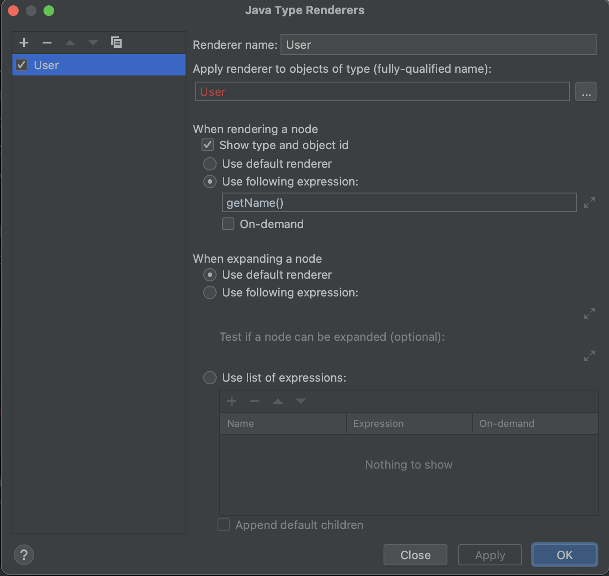

# Renderers

## THEORY

Debugging renderers are a feature that allows you to customize how variables and data are displayed during the debugging process. 
Debugging renderers provide a way to modify the default representation of objects, making it easier to understand complex data structures and objects with custom types.

**Did you now?**

Implementing a ToString on an object is actually already hooking into an existing renderer?  

## OVER TO YOU!

- Put a breakpoint on line 10.
- Run the code in debugging mode.
- The code halts execution
- Expand the users list variable. 
- As there are 3 different types, all 3 items in the list will show different "quick-view"
- Right mouse click on User object of list
- View as > Create Renderer
- You can choose that this renderer should act on interface User impacting all classes.
- Cou can call getName method for these nodes.

You will see the changes happen live in the debugging window. All 3 users should now have sam visualization.
