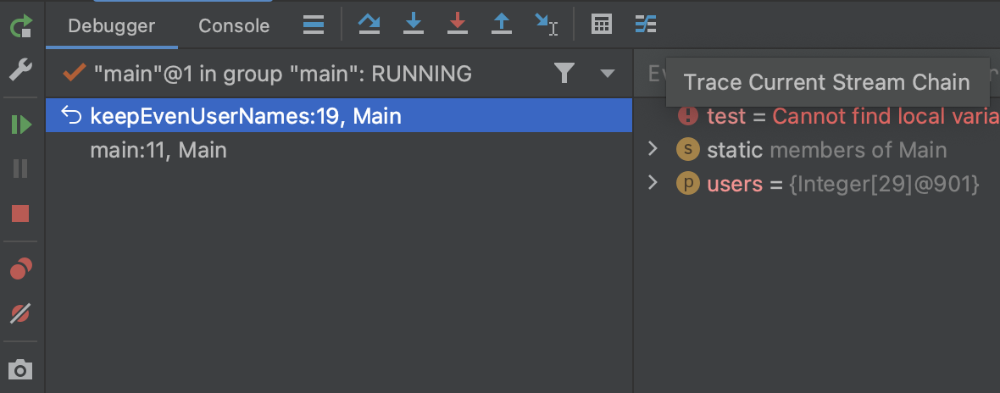
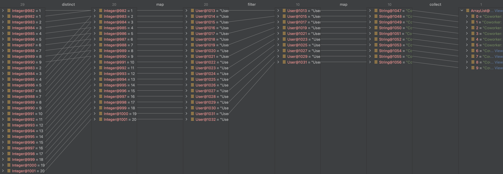
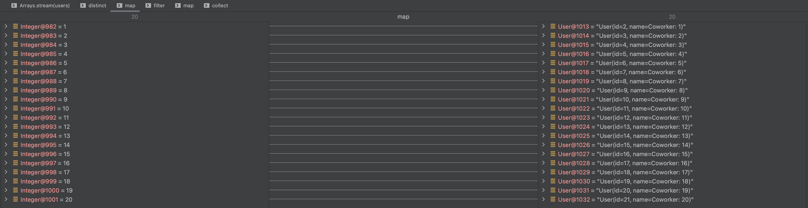

# Stream debugging

## THEORY

Stream debugging refers to the ability to debug code that uses Java Stream API operations. When debugging code that involves streams, IntelliJ offers several features to help you inspect and analyze the intermediate and final results of stream operations.

IntelliJ's Stream Debugger: Lets you see the individual elements flowing through a stream pipeline. You can observe how data is transformed at each step of the stream operations.

Besides this, you can ofcourse also use regular breakpoints, evaluate expressions etc...

## OVER TO YOU!

The provided main method is a method that will keep all even numbers in the input list and results in a list of Strings. 
Did the developer before you perhaps struggle a bit with Streams? Possibly, but perhaps he did put in some specific logic really needed to support a business case.
Making it very hard to analyze where a particular bug is coming from. 

Run the code. You will see an exception.

- We have a list of all unique numbers (as we used distinct): 1, 2, 3, 4, 5...
- The list is mapped to a coworker which has an id (`{nr}`) and a name (`Coworker: {nr}`)
- We keep the even id's coworkers
- Mapping to their name should be trivial
- Returning the list of names

Why is the first item not `Coworker: 2`? Let's see...

Put a breakpoint on line 19 and run the code. 

Now click on the "Trace Current Stream Chain" button (most right icon)

A popup will open. Allow it to analyze the stream. (for bigger collections this might be a heavier operation.)

You can cleanly see the way every element of the stream flows. 
Can you find the culprit map method impacting the filter later? 

Let's zoom in on it using the bottom left button to go to split mode. 
Now every item in the stream will be a tab.
And every tab will represent the input and output from that operation. 

An input number 1 receives a user id 2, but a name `Coworker: 1`. Weird is it not? Perhaps the `+1` in the constructor has something to do with it?

Congratulations, you have found the bug!
