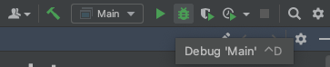
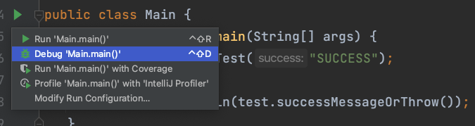
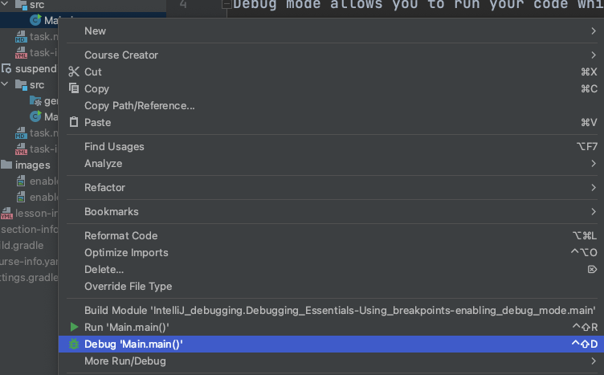

# Enabling debug mode

## THEORY

To enable running with breakpoints in IntelliJ IDEA, you need to start your program in debug mode.
Debug mode allows you to run your code while also pausing the execution at breakpoints, giving you the opportunity to analyze the program's state and step through the code. 

There are a lot of ways to enable the debug running in your applications using IntelliJ. We just listed some.

> **_NOTE:_**  If you are trying to learn the shortcuts, have a look at plugin `Key promoter X`.

In order to enable debug running you can look for the run configuration dropdown. There will be a bug icon listed nearby.

Another option to debug your code would be to click on the (Runnable) method you want to debug, and in the dropdown click on the `debug` option.
You will find such a play icon next to all the main methods, classes with a main method and all unit tests / unit test classes. 

IntelliJ will also automatically discover these methods from the project view. 
Simply right mouse click on the file you want to run and choose the debug option. 

## OVER TO YOU!

Try to run the Main class' `main` method in debug mode and see what happens. 

Experiencing a `RuntimeException`?

Way to go! No need to fix the code. Continue to the next task!
