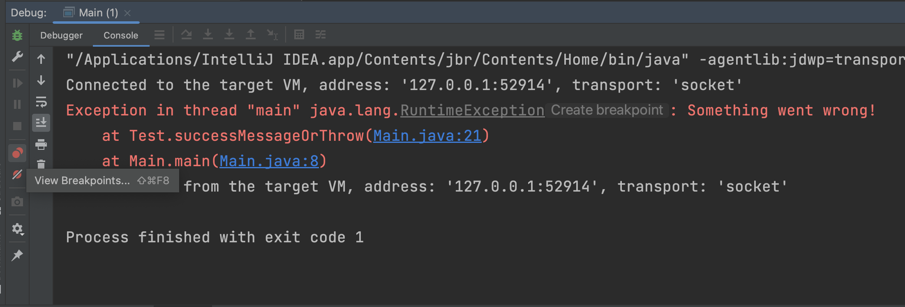
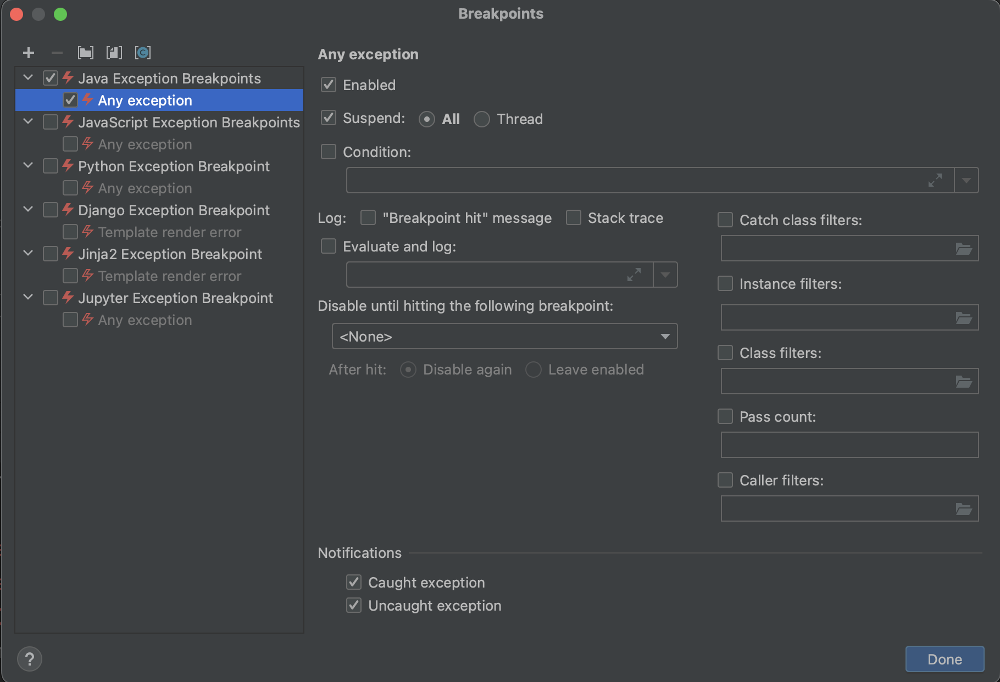

# Non-suspending breakpoints

## THEORY

Exception breakpoints are a type of breakpoint that allow you to pause the execution of your program whenever an exception is thrown. 
Unlike regular line breakpoints that pause the program at specific lines of code, exception breakpoints are triggered based on specific types of exceptions that occur during runtime.

Sometimes it is hard to identify from where a particular exception is being thrown.
An exception breakpoint can help you there!

## OVER TO YOU!

Remember that `RuntimeException`?

We will set a breakpoint that listens to **any** exception first by going to the breakpoint settings.

select the Java exception breakpoints there

Now run the code. 
The breakpoint should hit. 

If you tried this in a production application, you will probably encounter a lot of exceptions before you reach the one you actually need. 
Some frameworks (eg. Spring) use exceptions to abort specific autowiring steps, but do not crash because the abort that setup. 

Imagine a `NoClassDefFoundError` for `H2Driver` for an application that is not using H2. 
That exception would only result in the H2 setup not being run. Not an issue if you do not need H2.

Let's try to limit it to a specific exception. Open the breakpoint settings again and click on the plus at the left top. Don't forget to disable the all java exception setting at the meantime!
Choose 'Java Exception Breakpoint'.

Now in the filter search for NullPointerException and add it as a breakpoint.

Run the code. The code should crash without any breakpoint trigger. 

Now change the RuntimeException in the code to a NullPointerException and rerun the code.

Congrats! you have successfully listened to a specific type of breakpoint.
