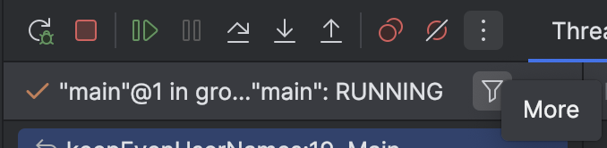

# Get to know the code

Take your time to get acquainted with the codebase.

Hit next when you see what will happen.

> **Throughout this course you will see several screenshots from intelliJ. Due to a recent change in the UI, the location of the buttons might be slightly different.**
> If you cannot find a button, try to look for a similar one with similar text or icon.
> The functionality should be the same.
> Most of the changes will be in the positioning of the buttons.
> If a button is not available in the view you see, try looking at the "More" menu (the 3 dots highlighted here).

