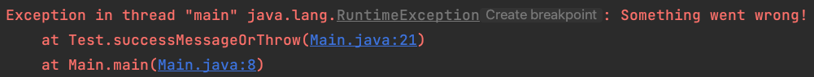

# Non-suspending breakpoints

## THEORY

Tired of `System.out.println("In method 1")` being checked into your code?

In IntelliJ IDEA, a non-suspending breakpoint is a type of breakpoint that does not pause the execution of your program when it's hit. 
Unlike regular breakpoints or suspending breakpoints that halt the program's execution, non-suspending breakpoints are primarily used for logging or triggering actions without interrupting the program flow.

You can put a breakpoint on a line (circles) or on a method (squares).
Breakpoints are set by clicking next to the line number of the line you want to initiate debugging. 
After clicking, right-click the breakpoint indicator and untick the `suspend` checkbox.
An additional context menu will appear. 
You can specify the extra actions here. 

## OVER TO YOU!

Remember that `RuntimeException`?

We will try to analyse the root cause by putting a non-suspending breakpoint on line 18.

Now right-mouse click on that breakpoint and disable the suspend checkbox.

The breakpoint indicator will turn yellow and additional options become visible.

For the 'condition' you can enter `!"TRUE".equalsIgnoreCase(success)` indicating that this breakpoint definition should only apply if the condition is met.

For the 'evaluate and log' you can enter `String.format("success = %s", success)`. In this field you can set whatever evaluation you want the output to have logged from. 
This can be a plain String, a method call...

Now run the code again.

Check the console, do you see your log? 

Now on line 6 change `SUCCESS` with `TRUE` and run the code again.

Check the console, do you see your log? You should not!

Don't feel like writing a `String.format` for every line? We've got you covered!

Right-mouse click again on the breakpoint and remove the previous settings. Then enable the `Breakpoint hit message` and/or the `Stack trace` options.

Now run the code again.

> **_NOTE:_**  You can freely combine all kinds of settings on this popup.
